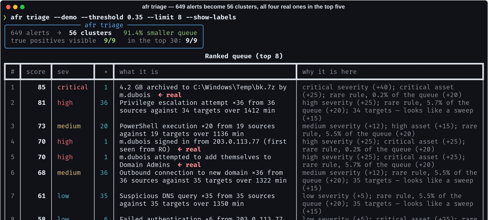
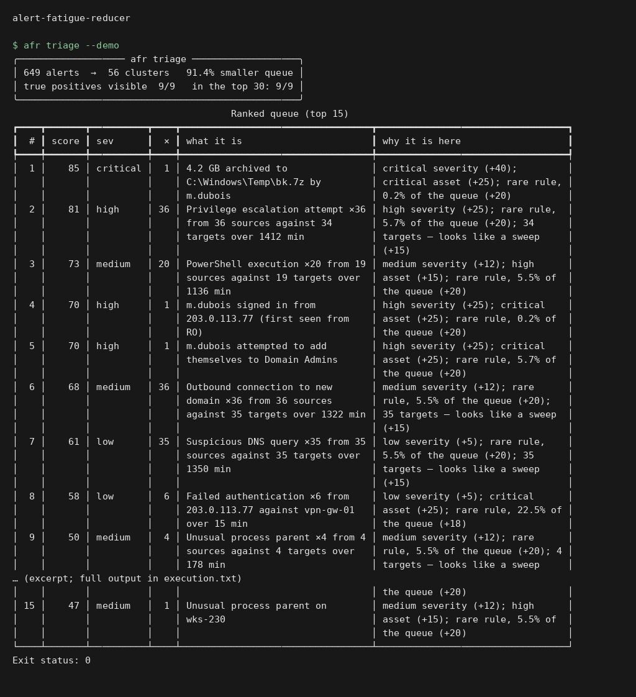
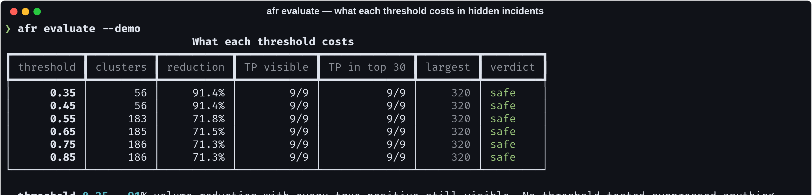
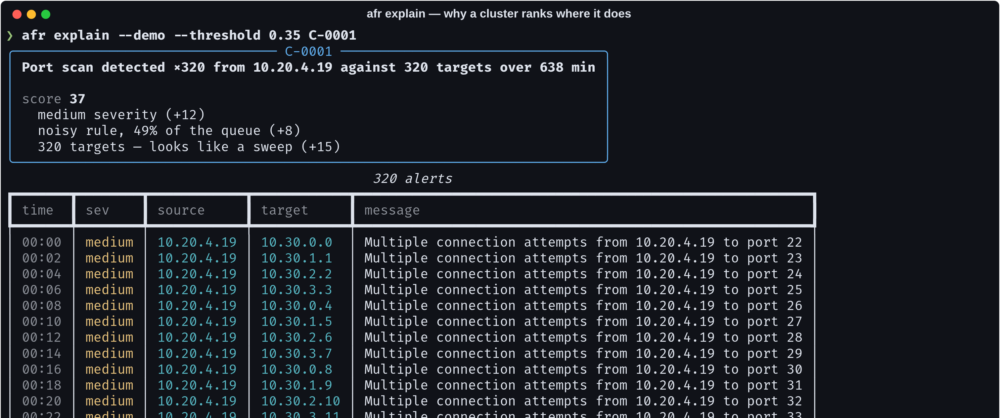

# alert-fatigue-reducer

> Every deduplication tool reports volume reduction. Deleting the queue reduces
> volume by 100%. The number nobody reports is **how many real alerts stopped
> being visible** — so this one refuses to print the first without the second.

[](https://github.com/Vincent-P-essy/alert-fatigue-reducer/actions/workflows/ci.yml)
[](pyproject.toml)
[](tests)
[](src/afr/cluster.py)
[](pyproject.toml)
[](LICENSE)

Clusters near-duplicate SOC alerts with MinHash + LSH, ranks what survives, and
measures the only thing that decides whether it was a good idea: whether the
real incidents are still there.



**649 alerts → 56 clusters (91% smaller), and all four alerts of the real
incident are in the top five.** The corpus is labelled and deterministic, so
that figure can be re-derived rather than believed.

## Execution preview



Local execution of `afr triage --demo`. The input and output shown come from the repository example or test fixtures. [Verification](docs/verification.md).

## The measurement

An alert is *visible* after clustering if it is the representative of its
cluster. A true positive sitting inside a cluster of 300 benign alerts, whose
representative is one of the benign ones, has been **suppressed** — nothing was
deleted, and an analyst will never see it.

Three numbers are reported together, always:

| | |
| --- | --- |
| **volume reduction** | how much smaller the queue got |
| **true positives visible** | how many survived clustering |
| **budget recall** | how many appear in the top *N* an analyst works in a shift |



`afr evaluate` sweeps thresholds and shows the trade-off instead of asserting
one. The recommendation is **the most aggressive threshold that suppresses
nothing**, never the best reduction — a tool that optimises volume and reports
suppression separately is one whose defaults hide incidents.

When nothing is safe, it says so:

> every threshold tested suppressed at least one true positive. Do not deploy
> this until the feature weights are re-tuned for your detection estate.

And `afr evaluate` on an unlabelled corpus **refuses to run**. Volume reduction
without ground truth is unfalsifiable.

## Feature weights are a security decision

Similarity is weighted, and the weights encode judgements an analyst would
recognise:

```python
FEATURE_WEIGHTS = {
    "rule":   3.0,  # different rules are rarely the same event
    "source": 2.0,  # collapsing one scanner's 400 alerts is the point
    "user":   2.0,
    "target": 0.5,  # low, deliberately: one attacker sweeping a /24 must not
                    # become 254 clusters — that IS the flood
    "text":   1.0,
    "category": 1.0,
}
```

Weight the target highly and the tool works perfectly on paper while leaving
the queue exactly as long. Getting this wrong does not crash anything; it
quietly hides attacks, which is why the weights are named constants with
reasons rather than numbers inside a function.

## MinHash + LSH, written out

Comparing every alert to every other is quadratic — fine for a thousand,
hopeless for a day of a real SIEM. Candidates come from locality-sensitive
hashing: 128-permutation MinHash signatures, cut into 32 bands of 4. Two alerts
with Jaccard similarity *s* collide in some band with probability
`1 - (1 - s⁴)³²` — an S-curve inflecting near 0.42, so a threshold rather than a
smear.

Candidates are then scored **exactly**, because the decision to merge two
alerts should rest on the real number and not a hash collision.

The obvious implementation hashes each token once per permutation — 128 blake2b
calls per token, about 2.5M for a day of alerts, and it dominated the runtime.
Hashing once and permuting with a universal family `h_i(x) = (a_i·x + b_i) mod p`
gives identical collision probabilities for a fraction of the work.

Single linkage is deliberate: a scanning host produces a chain of alerts that
drift gradually, and transitive merging is what collapses the chain.

Runtime dependency: `rich`, for the tables. The algorithm is stdlib.

## Ranking, and what the metric found



The score is additive so a rank can be explained to the analyst who disagreed
with it: severity, asset criticality, rule rarity, breadth, and disposition
history.

Budget recall started at **33%** — the real credential-stuffing attempt sat
outside a shift's triage. The cause: six *low-severity* failed logins from one
source against one critical asset. Scored on its representative alone, the
cluster ranked near the bottom; but repetition against a single critical target
is exactly what brute force looks like, and the cluster's size is the signal.
Adding that took budget recall to 100%.

The metric found it. Nobody reading the code would have.

## Feedback is the only learning

```python
feedback.record("Port scan detected", "benign")  # ×20
```

A rule an analyst has closed as benign forty times sinks. It needs **five
dispositions before it acts** — two closures are not a pattern — and it is the
only adaptive component. Everything else is explainable arithmetic, because a
ranking nobody can interrogate is a ranking analysts route around.

## Install and run

```bash
git clone https://github.com/Vincent-P-essy/alert-fatigue-reducer
cd alert-fatigue-reducer
pip install -e .

afr triage   --demo --threshold 0.35 --show-labels
afr evaluate --demo
afr explain  --demo C-0001
afr corpus   --out corpus.ndjson      # the labelled corpus, to check the numbers
```

On your own data — JSON, NDJSON, or `{"alerts": [...]}`:

```json
{"rule": "Failed authentication", "timestamp": "2026-07-20T03:14:00Z",
 "severity": "low", "source": "203.0.113.77", "target": "vpn-gw-01",
 "user": "m.dubois", "asset_criticality": "critical", "label": "true_positive"}
```

`label` is optional and used **only** by evaluation — never by clustering or
ranking. Label a few hundred alerts and you can measure what the tool costs you
instead of guessing.

## Where this stops

- **The threshold is estate-specific.** The bundled corpus recommends 0.35;
  yours will differ. That is what `afr evaluate` is for, and why no default is
  presented as correct.
- **The corpus is synthetic.** Realistically shaped and deliberately labelled,
  but it is not your queue.
- **Clustering is content-based, not causal.** It groups alerts that look alike.
  Linking a phishing email to the credential use that followed is correlation
  across data sources — a different problem.
- **No streaming.** Batch over a window. Incremental LSH is possible and would
  need a different index.
- **Feedback is per-rule.** Deliberately coarse: per-rule-per-host would learn
  faster and overfit to whichever host was noisy last week.

## Layout

```
src/afr/
  alert.py     the model, the weighted feature sets, ingest
  cluster.py   MinHash, LSH banding, union-find, the time window
  score.py     explainable ranking, feedback, the labelled corpus
  evaluate.py  reduction, suppression, budget recall, threshold sweep
  cli.py       triage · evaluate · explain · corpus
```

## Licence

MIT
